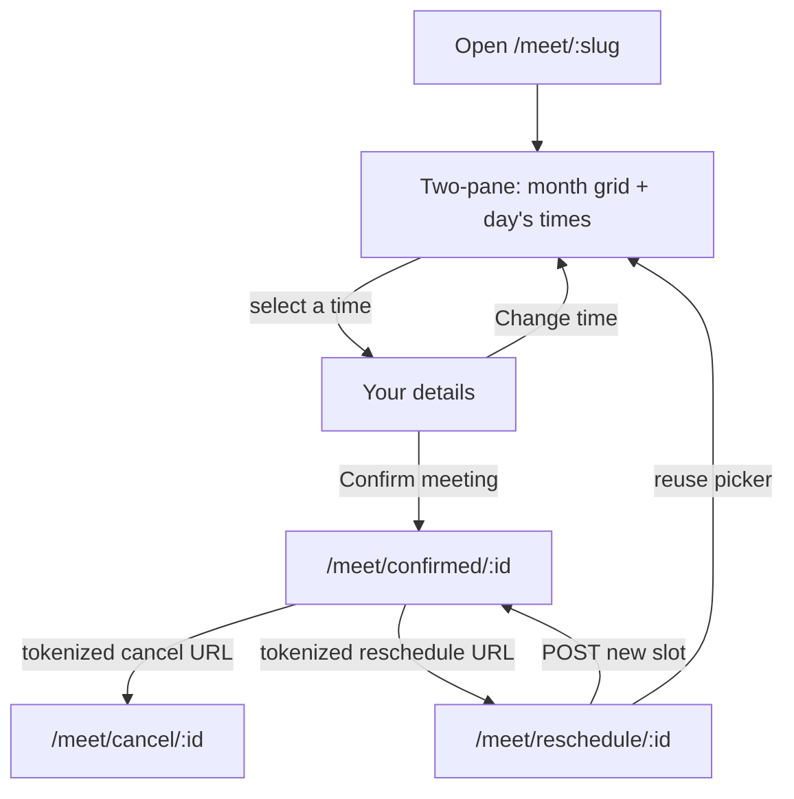
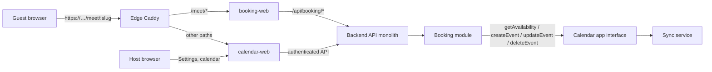

# Compass Calendar Booking (v1 / v1.1 / v1.3 / v1.5 / v1.6 / v1.7 / v1.8 / v1.9 / v1.10)

Locked product spec for public scheduling on Compass Cloud
(`https://compasscalendar.com`). Approved 2026-08-30. v1.1 shipped
RSVP-strict occupancy and public page identity (date-specific
availability exceptions were removed in v1.2). v1.5 shipped keyboard
Escape paths, guest edit-details after confirm, confirmation permalink
tokens, and the audit fixes on milestone Booking v1.5. v1.3 (guest
reschedule) is specified here and implemented. v1.6 shipped one-click
turn on, Essentials / More options, editable address, default hours,
branded connect pills, and funnel analytics. v1.7 shipped the Meeting
page redesign: `/meet` URLs, meeting copy, hold-Mod section chords, the
on/off switch, a per-day weekly hours list, and the first-run address
screen. v1.8 replaced that screen with a guided setup wizard, Start and End
menus for weekly hours, fewer host scheduling knobs, sidebar-only Mod chords,
no horizontal scroll, and the stale-holiday-calendar booking gate fix. v1.9
anchored Settings to the top, animated More options, let a day hold several
hour blocks, moved meeting timezone under More options, and trimmed helper
copy. v1.10 shipped the staging meeting-flow fixes: Meet on insert, hours
alignment, destination under More options, confirmation links only, host
reconnect and bookability status, the setup wizard dead-end fixes, host
new-meeting notice, sidebar discovery, an off page that keeps its
link, and unavailable guest-month days that announce no times available.

Compass never sends email itself. Google emails the guest when Compass
creates the calendar event with `invitation: "all"`.

## Status

v1, v1.1, v1.3, v1.5, v1.6, v1.7, v1.8, v1.9, and v1.10 are implemented in the Compass
monorepo (public `/meet/:username`, host Settings, backend APIs, guest
cancel, guest reschedule, edit-details, one-click turn on, Essentials /
More options, editable address, default hours, branded connect pills,
funnel analytics, meeting copy, hold-Mod section chords, the on/off
switch, a per-day weekly hours list that can hold several blocks, meeting
timezone under More options, the guided first-run setup wizard, Start
and End time menus, the v1.8 booking gate fix, and the v1.10 meeting-flow
fixes). Booking is enabled in every runtime environment, including
production (`isBookingEnabled` in `packages/core/src/util/env.util.ts`).
Guest `/meet` runs in **`apps/booking-web`**: its own frontend image and
deploy pipeline on the same Compass Cloud host (shared VPS, MongoDB, API,
and Sync). Caddy on that host routes `/meet/*` to the booking-web
container; calendar-web no longer serves those guest paths. A standalone
Compass Booking product (separate brand or domain) remains **explicitly
deferred**. Booking rules and reservations stay in the API monolith; there
is no Booking microservice in v1.

## Public URL

`https://compasscalendar.com/meet/:username`

Example: `https://compasscalendar.com/meet/tyler-dane`

The username is a `bookingSlug` on the host's Meeting page. Hosts choose it
in Settings before or after enabling. Interior hyphens are allowed (for
example `tyler-dane`). Changing the address overwrites the stored slug;
old slug links stop working and there are no slug redirects.

Legacy `/book` username, cancel, reschedule, and confirmed links still
work through client-side redirect routes that keep the search params
(`?token=` rides on cancel and reschedule links). API paths stay
`/api/booking/*`.

The guest's selection lives in `/meet/:slug` search params
(`?month=&date=&slot=&tz=`): Back returns from the details step to the
picker, refresh keeps the selection, and the link is shareable. Invalid
params drop to defaults; they never error.

Confirmation permalink: `/meet/confirmed/:reservationId?token=…`.
The cancel (and post-confirm edit) capability is that unguessable token,
not the reservation id. Just-confirmed navigation writes `?token=` into
the permalink so a reload, bookmark, or self-sent link keeps cancel and
edit. The public reservation GET does not return `cancelUrl` or the
token. A permalink without `token` still shows the booking from GET,
with no cancel or edit actions. Cancel and reschedule links always appear in
the event description because guests cannot add other attendees.
Reschedule copy stays history-only (v1.3).

Cancel: `/meet/cancel/:reservationId?token=…`.

Reschedule: `/meet/reschedule/:reservationId?token=…`.

Reserved slugs (never allocated): `week`, `day`, `life`, `auth`, `api`,
`cleanup`, `book`, `meet`, `cancel`, `confirmed`, `reschedule`, `p`,
`settings`, `admin`, `login`, `logout`, `signup`, `invite`, `calendar`.

### Slug allocation

Compass users have `name` and `email`, not a username
(`packages/core/src/types/user.types.ts`). When the host opens Meeting
Settings before a draft exists, the guided setup wizard starts on the
address step with `suggestedSlug` under the `.../meet/` prefix. **Continue**
(Mod+Enter) on that step saves a disabled draft (`PUT` with
`enabled: false` and the seeded defaults) so "That address is already taken"
shows on that step. Reopening Settings later lands on the full form with
the switch off when a slug is stored. The host may replace the address
later under More options; a draft keeps its chosen address even while
disabled.

When no slug is stored yet and the host enables without choosing one,
allocate `bookingSlug` once:

1. Slugify `name`: lowercase, keep `[a-z0-9]` only, so `Tyler Dane`
   becomes `tylerdane`.
2. If the result is shorter than 3 characters, slugify the email
   local-part the same way.
3. If still too short, use `user` plus the last 6 characters of the user
   id.
4. Truncate to 32 characters.
5. If the candidate is reserved or already taken, append `2`, `3`, …
   until unique.

Store the slug on a booking-owned profile row keyed by Compass user id
(not on Sync connection records). Unique index on `bookingSlug`.

## Product shape

v1 is **one Meeting page per Compass user**, with one duration. Multiple
appointment types are a later collection, not a v1 field.

### Host

The host must be an authenticated Compass user with a healthy,
writable calendar connection. Anonymous IndexedDB users do not get a
booking link. Password-only users see a connect-Google prompt in
Settings, not a broken public page.

Host administration lives in Settings as Meeting. The internal name
remains Booking page (`SettingsPage` includes `"booking"` in
`packages/web/src/settings/settings.store.ts`). There is no dedicated
`/booking` host app in v1.

### Host notice

When the host opens Compass, and again when the tab becomes visible after
at least five minutes, Compass claims new confirmed bookings and shows one
toast. One booking: `Bob booked a meeting: Thu, Sep 24, 12:00 PM`. Several:
`3 meetings booked since you last looked. Latest: Bob, Thu, Sep 24, 12:00 PM`.
Show moves the week view to that meeting. Times use the host's effective
timezone. Cancelled reservations are never announced. Compass does not send
email.

### Guest

The guest is unauthenticated. They open the public URL, pick a day on
the **month grid** and a time from that day's list, shown in **their
timezone** (browser default, overridable), enter name + email (optional
notes), and confirm. They do not need a Compass account.

Public booking uses `light-beach` when `compass.theme` is unset. A
stored theme wins.

### Guest keyboard path

Public booking is click-first and fully keyboard operable. Visible
focus uses the accent ring. Intended Tab order on the picker:

1. **Skip to open times** (focus-revealed link) jumps to **Pick a time**,
   skipping the month grid.
2. Timezone control, then previous/next month, then one tab stop on the
   selected day (arrow keys move among available days). Unavailable days
   stay out of the tab order, keep `aria-disabled="true"`, and include
   an sr-only suffix `no times available`.
3. One tab stop on that day's times (arrow keys move among slots, Home
   and End jump to first and last). Enter or Space on a day moves focus
   to the first slot. Enter or Space on a slot opens **Your details**
   and moves focus to that heading. **Skip to your details** is the
   first tab stop on that step.
4. **Change time**, then name, email, notes, **Confirm meeting**.
   **Change time** returns focus to **Pick a time**.
5. After confirm, `/meet/confirmed/:id` focuses **You're meeting with
   {host}**. Unknown, cancelled, and load-error states focus their
   headings.
6. A 409 conflict focuses the alert. Slot-load retry focuses **Pick a
   time**. Jump to next available day does the same.
7. Cancel (`/meet/cancel/:id`) focuses its heading on load and after
   each state change. Tab then reaches **Cancel this meeting**.
8. Reschedule (`/meet/reschedule/:id`) focuses **Reschedule your meeting
   with {host}** on load and after each state change. Tab then reaches
  the picker (same month grid and slot list as the public page), then
  **Confirm**. A 409 conflict focuses the alert. Missing or invalid
  token focuses the not-found heading.

The month grid stays in the DOM ahead of the slot list. The skip link
exists so keyboard users are not forced through every day cell before
times (and, on details, before the form).

### Escape

Escape peels one layer. OverlayPanel (timezone picker, discard confirm)
holds the app lock first.

- **Your details:** Escape is **Change time**. Focus returns to **Pick a
  time**.
- **Timezone overlay:** Escape closes the overlay and leaves the current
  step (picker or details) in place.
- **Slot list:** Escape moves focus to the selected day. It does not
  change the URL.
- **Month grid:** Escape is a no-op. It does not leave `/meet/:slug`.
- **Confirmation** (`/meet/confirmed/:id`): Escape returns to
  `/meet/:bookingSlug` and focuses **Meet with {host}**. Unknown,
  cancelled, and load-error states have no slug path and stay put.
- **Edit details:** Escape returns to confirmation without PATCHing.
- **Cancel confirm** (`/meet/cancel/:id`): Escape returns to
  `/meet/confirmed/:id` with the same `?token=` and does not POST.
  In-flight cancel does not navigate or abort.

### Outcome

On confirm, Compass creates a timed event on the host's destination
calendar, invites the guest, and adds a conference link when the
destination supports one (Google Meet, Microsoft Teams, or none). The
Google insert request includes `conferenceDataVersion: 1` so Meet is
actually minted on the event. The provider emails the invite. Compass
shows a confirmation screen with the booked time (guest timezone) and
names that conference kind. Cancel and edit-details are present when the
permalink carries `?token=`. Reschedule links stay history state only
(v1.3).

**Event title:** `{Guest name} and {Host name}`.

**Event description:** three blocks separated by blank lines: guest notes
(when present), `Cancel: <url>`, and `Reschedule: <url>`. In Compass the
description editor renders each block as its own paragraph and autolinks
bare URLs. Guests cannot add other attendees, so those URLs are safe in
the description every invitee sees.

## Host inputs

One booking-page record per user.

| Input | v1 rule |
| --- | --- |
| Duration | `15` / `30` / `45` / `60` minutes. Default `30`. Custom minutes later. |
| Destination calendar | Writable calendar (`canWriteEvents`) on a healthy connection. Receives the created event. |
| Blocking calendars | Calendars whose busy intervals occupy slots. Any calendar the host can read availability for, including `freeBusyReader`. Default: every imported calendar on the destination account. |
| General availability | Weekly intervals in the **host booking timezone**. Empty weekday = unavailable. Default Mon-Fri 09:00-17:00 as one block per weekday on the per-day list. Turning on requires at least one window (`AVAILABILITY_REQUIRED`). Default timezone: the timezone currently in the host's calendar view when they first enable booking, not UTC. An unconfigured admin GET uses the host's primary calendar timezone. |
| Scheduling window | Minimum notice default **4 hours**, capped at **1440 hours** (the 60-day horizon in hours). Maximum horizon default **60 days**. The 60-day cap matches Sync's busy-query bound (`BUSY_QUERY_MAX_WINDOW_MS` in `packages/core/src/types/sync/availability.contracts.ts`). |

**Slot grid:** 15-minute starts in the host timezone, filtered so a slot
of `duration` fits inside an availability interval after busy blocks.
Back-to-back meetings are allowed.

### Host Settings controls

The Settings **Meeting** page is keyboard-first. It is split into a
status header, an Essentials group, and a collapsed **More options**
group. Hours are a per-day list: a checkbox, short label, Start and
End menus, and an action cell. Settings is anchored to
the top of the viewport and grows downward; More options animates
open over about 200 ms, and reduced motion disables the animation.
The dialog panel is a compositor layer at mount. An inner wrapper
scrolls, so the first wheel tick does not re-rasterize the backdrop.

- **Status:** a **Meeting page** switch reflects whether the page is
  live. When on, it shows the meeting link with Copy and
  **Open meeting page**. When off and the page has been saved, it
  still shows the meeting link with Copy (not Open, because the public
  page answers not found) and the line "Off. Guests can use this link
  once you turn it on." When off and the host has never saved a page,
  it shows "Off. Turn it on to share your link." and "It will be at"
  plus the address. Typed-but-unsaved address edits do not change the
  copyable link until Save.
  Once a page has been saved, a broken calendar connection does not
  hide the switch or the link. A status banner above the header says
  what is wrong: reconnect (`Guests can't book right now.` plus the
  reconnect sentence and a **Reconnect Google Calendar** button, or
  the matching label for another provider), importing (`Your calendar
  is still importing. Guests can book once it finishes.` with no
  button), or not connected (`Connect a calendar to turn your page
  back on.` with the connect buttons). The first-run connect prompt
  is only for a host who has no saved page.
  When the page is live, a **Host status** line under the link reports
  whether guests can book right now. It uses the same readiness probe
  as guest slots (`GET /api/booking/page/status`). If they cannot, the
  line is `Guests can't book right now:` plus the reason and the fix:
  reconnect for `actionRequired` / `disconnected`; importing and delayed
  copy for those connection states; calendar name plus catch-up or
  remove-from-blocking copy for `stale` / `neverSynced` / `notImported`;
  the existing paid-subscription sentence for billing. The Settings
  nav **Meeting** button shows a warning dot and sr-only
  `needs attention` while the page is live and not bookable.
- **Essentials:** duration and weekly hours. These fit without scrolling
  at 1440x900.
- **More options:** an uncontrolled native `
` that starts
  collapsed. It holds page address (the slug rule appears only as an
  error; "Links using your old address will stop working." when the
  slug changes), destination calendar, meeting timezone, blocking
  calendars, minimum notice, and maximum horizon. Jumping to a field
  inside it, or an invalid field in the group, opens it. Do not
  control the `open` prop from React: the jump-key code opens the
  element imperatively.
- **First run:** before any draft exists, Meeting settings open a guided
  setup wizard: one question per screen with "Step N of M", a title, one
  sentence, and **Continue** (Mod+Enter). Steps are address, weekly hours,
  duration, destination calendar (hidden only when exactly one writable
  calendar exists; with zero writable calendars the destination step shows
  "Connect a calendar you can write to before going live." and connect
  buttons, **Continue** stays disabled, and go live is unreachable until a
  writable calendar exists), then go live. Every step after the first shows
  a **Back** button (Esc) beside **Continue** (Mod+Enter); the shortcuts sit
  on the buttons, there is no separate hint row. Plain Enter also continues
  from the address input or the Continue button; Esc goes back one step (on
  step 1 it closes Settings). When the address step fails with
  "That address is already taken. Try another.", focus moves to the address
  field. Address **Continue** saves a disabled draft so the slug is reserved.
  **Turn on and copy link** on the last step saves with `enabled: true`,
  copies the link, and then shows the full form with the switch focused.
- **Discovery:** a signed-in host whose page is not live sees a sidebar
  card, **Skip back & forth**, under the calendar list. **Set
  up meeting page** opens Settings on the Meeting tab. **Dismiss** hides
  the card on that browser. Turning the page on hides it everywhere. The
  card does not show on mobile or while the first-event prompt is still
  pending.
- **Timezone** uses the same searchable combobox as time travel. The
  trigger is one tab stop and still renders a stored non-canonical alias.
  It lives under More options on the configured form. The setup wizard
  hours step shows a muted line with the city and abbreviation. The
  go-live summary lists a **Timezone** row with the same label.
- **Weekly hours** are a list of the seven ISO weekdays, Monday first.
  Each line is a checkbox named with the full weekday, the short label,
  a Start menu, the word "to", an End menu, and one action cell. Menus
  step by 15 minutes with 12-hour labels (`9:00 AM`). An unchecked day
  shows only the checkbox and label and keeps the same line height and
  column widths. Extra lines under a day align with the first line's
  Start and End menus.
  The default is Monday to Friday, 9:00 AM to 5:00 PM. **Add hours to
  Monday** on a day's first line adds a second block under that day;
  each extra line's action cell removes that block. Start and End
  options are bounded by neighbouring blocks so an overlap cannot be
  produced. A newly added line eases in; reduced motion disables that.
- **Jump:** hold Mod to see sidebar digits `1/2/3` and Enter on Save
  (or Continue). Meeting fields, legends, summaries, and the Copy
  button have no shortcut chips. Sidebar digits above `3` and letter
  chords do nothing on Meeting settings. Save stays Mod+Enter. Save-error focus
  still uses
  `data-booking-field` and does not click, so focusing a checkbox does
  not toggle it. Before focusing, the helper opens any ancestor
  `
`. The Settings nav shows one hint, **Hold Mod to see
  shortcuts.**, while chips are hidden.
- **Turn on / Save:** going live is one click on the Meeting page
  switch, which saves immediately with the current form. The save bar
  has one primary **Save changes** (Mod+Enter) that keeps the current
  on or off state. Validation and server errors render beside the save
  bar and focus the offending field. A failed enable leaves the switch
  off.
- **Toasts:** turning on copies the link (`Your meeting page is live.
  Link copied.`, or `Live. Use Copy to share your link.` if the
  clipboard fails). Save changes while on copies the link, or
  `Saved. Use Copy to share your link.` if the clipboard fails. Turn
  off says `Meeting page turned off.` Save changes while off says
  `Saved. Turn on your meeting page to share the link.` Safari can
  drop a copy that follows the save round trip; the Copy button stays.
- **Open meeting page** sits next to Copy and opens the public URL in a
  new tab. There is no authenticated preview iframe.
- **Discard:** Escape on a dirty Booking form opens **Discard unsaved
  changes?** instead of closing Settings. Cancel (Escape) keeps the
  edits. **Discard** (Shift+Escape or Mod+Enter) closes Settings without
  saving.

## Busy occupancy

v1.1 occupancy is RSVP-strict. Sync still returns facts only; Booking
decides whether a busy interval occupies a slot
(`packages/core/src/booking/occupies-booking-slot.ts`).

- Occupied = an occurrence with `busy: true` and `cancelled: false`,
  **and** the host is the organizer **or** has accepted.
- `needsAction`, declined, and tentative invites do not occupy.
- Transparent / free events do not block. Cancelled occurrences stay
  excluded.
- Legacy busy intervals with no occupancy facts still occupy (fail
  closed to the pre-v1.1 busy-only behavior).
- Confirm **fail-closed**: if Sync returns `bookable: false` (stale,
  unhealthy, or incomplete), the slot is not offered and confirm is
  rejected (`409`). See
  [Product Suite Boundaries](../architecture/product-suite-boundaries.md).
- **Cursor-expiry hold-off freshness:** when Sync is holding off
  incremental pulls on a calendar because its watch cursor keeps expiring
  (`cursorExpiredBackoffUntil`), booking treats the resource as fresh for
  the hold-off window plus a short reconcile grace. Sync chose not to poll,
  so the last completed repair stays authoritative; the grace covers the
  sweep lap after hold-off expiry. The rule keys on the hold-off timestamp,
  not watch support, so unwatchable Apple CalDAV calendars still use the
  normal 30-minute `maxAgeMs` gate.
- The public busy wire never includes titles, attendees, or emails.
  Optional facts are `hostIsOrganizer` and `hostResponseStatus` only.

## Guest cancel and edit details

- Confirmation page includes a tokenized cancel URL when `?token=` is on
  the permalink (just-confirmed navigation writes it there). The event
  description always carries cancel and reschedule URLs. A permalink
  without the token does not invent a cancel path.
- **Edit details** uses the same token. Name and notes only; email is not
  on the form and is not accepted on PATCH. **Save details** PATCHes
  `{token, name?, notes?}` and rewrites the Google event title and
  description. **Back** or Escape returns to confirmation without saving.
- Token is unguessable and stored hashed on the reservation as
  `cancelTokenHash`. It stays valid until `slotEnd` and then returns
  the same generic not-found as an unknown token.
- Create and cancel persist a booking-owned operation with a stable
  calendar event id before the provider call. Retrying the same guest
  intent reuses that identity. A bounded recovery job finishes in-flight
  work after a lost response, restart, or expired guest token.
- Cancel marks the reservation `cancelling` first so a crash after the
  provider delete cannot leave a confirmed row occupying the slot, then
  deletes the calendar event (host as organizer, `invitation: "all"`).
  `cancelling` is not a finished cancel: reload keeps retrying until the
  event is gone, then the reservation is `cancelled`. A failed delete
  still frees the slot; retry deletes while `calendarEventId` remains.
  Idempotent: a second cancel after a successful delete is a no-op.
  Failed create compensation is the same operation record, not log-only.
- Expired / unknown tokens return a generic not-found page, not a
  leak of whether the booking existed.

## Guest reschedule (v1.3)

Guest-only. Hosts keep editing or deleting the calendar event in Compass.
There is no host reservation inbox.

- Reuses `cancelTokenHash` / `?token=`. No second secret.
- Confirmation shows a **Meeting actions** group with **Cancel this
  meeting** and **Reschedule this meeting** as links only, when those
  URLs exist. There are no copy-link buttons. Cold permalink has
  neither reschedule secret. Cancel and edit use `?token=` on the
  confirmation URL (see Guest cancel and edit details).
- `/meet/reschedule/:id?token=` reuses the public month/slot picker. Do
  not re-collect name, email, or notes. Confirm and reschedule both pin
  `durationMinutes` from the page the guest saw: a mismatch with the
  current page duration is `409`.
- In-place Google PATCH of the existing event: same `calendarEventId`,
  same Meet URL, same attendees. `invitation: "all"`,
  `attendeesEdit: "preserve"`. Compass still sends no email.
- While choosing a new time, this reservation must not occupy slots.
  Other overlapping host events still occupy.
  Tokenized slots: `GET /api/booking/reservations/:id/slots`.
- Status stays `confirmed`; mutate `slotStart` / `slotEnd`. Same slot is
  an idempotent success (no second Google write). Cancelled or bad token
  → same generic not-found as cancel. New slot re-check uses
  `purpose: "booking_confirmation"`; race → `409`.

## Architecture

Stay in this monorepo. Booking owns rules and reservations. Calendar and
Sync own events and busy. No Booking microservice in v1.

- **Contracts:** Zod in `packages/core` (`@core/types/booking.*.ts`).
  Domain entrypoints (`@compass/contracts/booking`) wait until the
  AGENTS.md contract-placement rule actually changes.
- **Persistence:** Booking-owned Mongo collections (page config,
  reservations). Calendar collections stay Calendar/Sync-owned.
  Cross-domain references are stable ids only.
- **Web (guest):** `apps/booking-web` is a separate static SPA container.
  Full deploys (`Deploy staging`, `Deploy production`) build and start it
  with the `booking` profile; `Deploy staging booking-web` (`./compass
  update-booking-web`) is the staging-only fast path. On shared Compass
  Cloud and self-host stacks it listens on `bookingWeb.port` (default
  `9081`; `9082` on production) behind Caddy's `/meet/*` path matcher. Local dev: `bun run dev:booking-web` on port `9081`;
  `bun run dev:web` redirects guest `/meet` and `/book` to that origin.
- **Web (host):** Meeting Settings and host booking funnels stay in
  `packages/web` (calendar-web). They use the authenticated layout and
  `packages/web/src/api/booking.api.ts`; they do not boot the guest SPA.
- Native iOS/desktop later call the same Booking HTTP contracts. They do
  not import web views.
- Confirm path: compute slots from availability + busy; on submit,
  re-query Sync with `purpose: "booking_confirmation"`, then
  `Calendar.createEvent` with the guest as attendee, `invitation: "all"`,
  `createConference: true` when the destination conference is not
  `none`, and `guestsCanInviteOthers: false` on every create.
  A race on the same slot: the second confirm fails; no double event.
  Reschedule re-queries the same way, PATCHes the existing event
  (`invitation: "all"`, `attendeesEdit: "preserve"`), and keeps
  `calendarEventId`.

Public API must be rate-limited (IP + slug), never leak event titles or
attendees (busy intervals only), and must not require a SuperTokens
session.

## HTTP sketch (normative)

Unauthenticated:

- `GET /api/booking/pages/:slug` — public page (host display name,
  duration, timezone, enabled). `404` when missing or disabled. A host who cannot write is `409` with
  `This page is not accepting meetings.` (no billing, plan, or payment
  wording).
- `GET /api/booking/pages/:slug/slots?start=&end=&timeZone=` — bookable
  instants for that window, computed in the **host** timezone. `timeZone`
  is required (guest rendering and logs) and does not change the slot
  set. The guest UI requests **one month at a time** (plus prefetch of
  adjacent months). Window must be within the 60-day horizon. A host who
  cannot write is `{ slots: [], bookable: false }`.
- `POST /api/booking/pages/:slug/reservations` — `{slotStart, guestName,
  guestEmail, notes?, guestTimeZone, durationMinutes}`. `durationMinutes`
  must match the page. Mismatch is `409` with no Google event. Re-checks
  billing and busy, then creates. A host who cannot write is the same
  `409` as GET page and submits no create command.
- `GET /api/booking/reservations/:id` — public confirmation payload
  (`slotStart`, `guestTimeZone`, `durationMinutes`, `hostDisplayName`,
  `status`, `bookingSlug`, `guestName`, `notes`). `404` when missing. No
  guest email or cancel token.
- `PATCH /api/booking/reservations/:id` — `{token, name?, notes?}`. Verify
  token. Updates the reservation and rewrites the calendar event title and
  description. Guest email is not accepted. `404` when missing, cancelled, or
  the token is invalid.
- `POST /api/booking/reservations/:id/cancel` — `{token}`.
- `GET /api/booking/reservations/:id/slots?token=&start=&end=&timeZone=`
  — bookable instants excluding this reservation from occupancy.
  Same window rules as the public page slots endpoint.
- `POST /api/booking/reservations/:id/reschedule` — `{token, slotStart,
  guestTimeZone, durationMinutes}`. `durationMinutes` must match the page
  (same pin as confirm). In-place calendar PATCH. Same slot is an
  idempotent success. Create response includes `rescheduleUrl`.

Authenticated (host session + writable billing, same as event writes):

- `GET /api/booking/page` — host page, including slug and copyable URL.
- `GET /api/booking/page/status` — whether guests can book right now.
  `{ bookable, reasons }` from the same readiness probe guest slots use.
  A disabled page, or no record, answers `{ bookable: true, reasons: [] }`.
- `PUT /api/booking/page` — replace settings. Accepts optional `slug`.
  Allocates slug on first enable when none is stored. `409` with
  `SLUG_TAKEN` when the requested address belongs to another host.
- `POST /api/booking/page/new-meetings/claim` — read unclaimed confirmed
  reservations, then advance `hostNoticedAt` (and the last claimed
  reservation id) only through that set. Returns `{ count, latest }`.
  `{ count: 0, latest: null }` when there is no page, it is off, or
  another claim already reported the same rows. Cancelled reservations
  are omitted. Concurrent claims do not double-report. A failed read
  does not move the watermark.
- Enabling without a healthy calendar connection is a typed `403`
  (`CALENDAR_NOT_CONNECTED`; `CALENDAR_NOT_CONNECTED` remains an alias).
- Enabling with zero weekly hours is a typed `400` (`AVAILABILITY_REQUIRED`).

## Out of v1 / v1.1

Guest reschedule is **in scope for v1.3**, not v1 / v1.1.

- Multiple event types / appointment types
- Custom intake questions
- Paid booking
- Team pages and round-robin
- Compass-sent email or SMS
- `guestsCanModify`
- Standalone booking brand or domain (guest `/meet` SPA already ships in
  `apps/booking-web` on shared infra)
- Production billing packaging specific to booking (uses the existing
  calendar write gate)
- Host reservation inbox
- Meet URL on the confirmation screen (Google creates conference
  asynchronously; the invite email already has it once
  `conferenceDataVersion` is forwarded on insert)

## Implementation

### Implementation map

| Area | Path |
| --- | --- |
| Shared contracts | `packages/core/src/types/booking.contracts.ts` |
| Slot engine | `packages/core/src/booking/compute-booking-slots.ts` |
| Occupancy policy | `packages/core/src/booking/occupies-booking-slot.ts` |
| Backend admin API | `packages/backend/src/booking/controllers/booking.controller.ts`, `services/booking-page.service.ts` |
| Backend public API | `packages/backend/src/booking/booking.routes.config.ts`, `services/public-booking.service.ts`, `services/booking-readiness.ts` |
| Reservations + cancel tokens | `packages/backend/src/booking/booking-reservation.repository.ts`, `booking-cancel-token.ts` |
| Booking operations | `packages/backend/src/booking/booking-operation.repository.ts`, `booking-operation.record.ts`, `booking-lifecycle.analytics.ts` |
| Calendar application port | `packages/backend/src/booking/services/calendar-booking.port.ts` (`updateBookingEvent`), `services/calendar-booking.service.ts` |
| Sync busy occupancy | `packages/sync/src/domain/occurrence-projection.ts`, `busy-query.service.ts`, `booking-occupancy-facts.ts` |
| Host Settings UI | `packages/web/src/booking/BookingSettingsSection.tsx`, `packages/web/src/booking/setup/`, `BookingStatusHeader.tsx`, `BookingConnectionBanner.tsx`, `BookingBookabilityNotice.tsx`, `BookingMoreOptions.tsx`, `BookingSaveBar.tsx`, `BookingAddressField.tsx`, `BookingBlockingCalendarsField.tsx`, `BookingWeeklyHoursEditor.tsx`, `weekly-hours.ts`, `useNewMeetingsNotice.ts`, `packages/web/src/components/Switch/Switch.tsx`, `packages/web/src/components/Settings/SettingsModal.tsx` |
| Host booking funnels | `packages/web/src/auth/posthog/booking-funnel.ts`, `packages/web/src/auth/posthog/track.ts` |
| Guest booking funnels | `apps/booking-web/src/telemetry/guest-booking-funnel.ts` |
| Sidebar discovery | `packages/web/src/components/Sidebar/MeetingPageNudge/` |
| Description flattening | `packages/web/src/components/DescriptionEditor/plain-text-description.ts` |
| Public guest UI | `apps/booking-web/src/booking/` (for example `PublicBookingPage.tsx`, `PublicBookingMonthGrid.tsx`, `PublicBookingConfirmedPage.tsx`, `PublicBookingCancelPage.tsx`, `PublicBookingReschedulePage.tsx`, `PublicBookingEditDetailsForm.tsx`) |
| Guest web API client | `apps/booking-web/src/api/public-booking.api.ts` |
| Host web API client | `packages/web/src/api/booking.api.ts` |
| booking-web app | `apps/booking-web/` (`Dockerfile`, `dev.ts`, deploy workflow) |
| E2e | `e2e/booking/` (guest specs via `publicBookingAppUrl()` → booking-web), `e2e/booking/public-booking-reschedule.spec.ts`, `e2e/accessibility/booking-a11y.spec.ts`, `e2e/booking/calendar-web-guest-meet.spec.ts` (calendar-web must not serve guest `/meet`) |

### Analytics

PostHog product events for the host nothing-to-live funnel and the guest
page-to-confirm funnel. No guest name, email, notes, reservation id, slug,
raw URL, or capability token. Autocapture, session replay, and exception
capture are **dropped** on public `/meet/*` and `/book/*` routes because
those payloads embed DOM text, hrefs, and messages that cannot be rewritten
onto the allowlist. `$pageview` / `$pageleave` / `$web_vitals` and the
named events below still send, after `filterPosthogBookingTelemetry`
rewrites URLs to route categories (`meet_page`, `meet_confirmed`,
`meet_cancel`, `meet_reschedule`, and the legacy `book_*` equivalents).

The rewrite lives in `packages/core/src/booking/booking-telemetry.ts` and
is also applied to backend HTTP access logs, Winston messages, OTel log
attributes, PostHog exception properties, and server `capture()` payloads.
Diagnostic reservation ids stay in Mongo; they are not exported analytics.

Guests are never `identify`'d or `alias`'d. Host `useIdentifyUser` runs
only inside calendar-web. booking-web does not mount the authenticated
shell. Anonymous guest pageviews stay anonymous and do not join to a
host. Production, staging, and test traffic split on
the registered super-property `environment` (`NODE_ENV`); that is not PII.

`track()` swallows capture exceptions, so analytics failure never
interrupts booking. `booking_reservation_created` is browser-observed
confirmation after the public confirm mutation succeeds. Authoritative
server completion is the backend `booking_operation` event, emitted on
durable Mongo status transitions (not on HTTP retries of an in-flight
row). Recovery health is `booking_operation_heartbeat`, sampled every
five minutes including zeros so missing telemetry is distinct from an
idle queue. Provider connection health stays on Sync
`sync_health_snapshot` (PostHog dashboard 1905421).

Host funnel events: `packages/web/src/auth/posthog/booking-funnel.ts`.
Guest funnel events: `apps/booking-web/src/telemetry/guest-booking-funnel.ts`.
Conversion windows: host settings_opened to link_copied, 7 days; guest
page_viewed to reservation_created, 1 day.

#### Counting

Rerenders and identical refetches do not duplicate a transition. Reload
starts a new session. Back into a wizard step counts as another
`booking_setup_step_viewed`. Completing the same wizard step twice (Back,
then Continue) counts another `booking_setup_step_completed`. Slot
identity is `slotStart`: picking a different slot after conflict counts;
Change time then confirming the same slot does not. Confirm clicks always
count (`booking_submit_attempted`); validation, conflict, unavailable,
rate-limit, and transport failures are separate `booking_submit_failed`
reasons. Month changes can emit another `booking_slots_loaded`; a refetch
of the same month and outcome does not.

Host cohorts: `configured_host` on `booking_settings_opened` and
`booking_setup_step_viewed` (snapshot at Settings mount, not after the
address draft save). First-time go-live vs later re-enable is
`booking_page_enabled.first_time`.

#### Event catalog

| Event | Allowlist | Trigger | Denominator |
| --- | --- | --- | --- |
| `booking_settings_opened` | `has_connection`, `is_live`, `is_bookable`, `configured_host` | Settings > Meeting mounts after the page is known, or after the connect prompt knows the page is unconfigured. Disconnected hosts keep `is_live: false` | Unique hosts opening Meeting settings |
| `booking_setup_step_viewed` | `step` (`address` \| `hours` \| `duration` \| `destination` \| `live`), `configured_host` | Guided wizard shows that step | `booking_settings_opened` where `configured_host` is false |
| `booking_setup_step_completed` | `step` | Continue succeeds (address after draft save; hours/duration/destination after validation; live after turn-on save) | `booking_setup_step_viewed` for the same `step` |
| `booking_setup_save_succeeded` | `step` (`address` \| `live`) | Wizard PUT succeeds | `booking_setup_step_viewed` for that step |
| `booking_setup_save_failed` | `step` (`address` \| `live`), `reason` (`validation` \| `slug_taken` \| `destination_not_writable` \| `blocking_calendar_invalid` \| `availability_required` \| `timezone_required` \| `billing_required` \| `invalid_input` \| `transport`) | Wizard PUT fails, or address Continue fails client validation | `booking_setup_step_viewed` for that step |
| `booking_page_enabled` | `first_time` | Turn-on save succeeds. `first_time` is true when the page had no `bookingUrl` before this save, or the host used wizard go live | `booking_settings_opened` |
| `booking_link_copied` | `source` (`button` \| `save`) | Successful copy from Copy, or auto-copy after a successful turn-on / save | `booking_page_enabled` |
| `booking_page_viewed` | `duration_minutes` | Public page query succeeds with `enabled: true`, once per slug in the page instance | Unique anonymous guest sessions on an enabled page |
| `booking_slots_loaded` | `outcome` (`available` \| `empty` \| `unbookable` \| `error`), `duration_minutes` | Slots query settles for the month in view | `booking_page_viewed` |
| `booking_slot_selected` | `duration_minutes`, `timezone_differs` | Guest has a `slotStart` (click or URL), once per slot identity | `booking_slots_loaded` where `outcome` is `available` |
| `booking_details_reached` | `duration_minutes`, `timezone_differs` | Details step is shown for that slot identity | `booking_slot_selected` |
| `booking_submit_attempted` | `duration_minutes` | Guest clicks Confirm meeting (including validation failures) | `booking_details_reached` |
| `booking_submit_failed` | `reason` (`validation` \| `conflict` \| `unavailable` \| `rate_limited` \| `transport`), `duration_minutes` | Confirm fails client validation or the mutation errors | `booking_submit_attempted` |
| `booking_reservation_created` | `duration_minutes` | Guest confirm mutation succeeds (browser-observed, not server completion) | `booking_submit_attempted` |

Do not send scheduled timestamps, IANA zone names, slugs, or guest
identifiers on these events. `timezone_differs` is true when the guest
zone is not the host page zone.

#### Server operation catalog

Owner: `packages/backend/src/booking/booking-lifecycle.analytics.ts` and
`booking-lifecycle.heartbeat.ts`. Distinct id is `compass-backend-booking`.
Capture uses `captureSafely` and is never awaited on the booking write
path. PostHog outage cannot fail a reservation; Mongo is the source of
truth. Captures that drop are not replayed.

Dedupe: emit once per durable transition (insert of a new pending row,
first `submitted`, first `lastError`, `confirmed` / `recovered`,
`failed`, `compensated`). Duplicate-key reuse of an in-flight row does
not emit `accepted` again. Claim/lease increments do not emit. A random
analytics delivery id is not sent; reservation, command, event, and
guest identifiers are forbidden.

`source: request` covers HTTP outcomes that never become an operation:
validation (`400`), conflict (`409` `SLOT_UNAVAILABLE` /
`RESERVATION_CONFLICT`), and mutation `429`. Provider, transport, and
storage failures after an operation exists use `source: operation`.

Heartbeat `retry_exhausted_count` is `status: failed` updated in the
last 24 hours. `pending_count` is current `pending` + `submitted` +
`compensating`. `oldest_pending_age_ms` is age of the oldest of those
by `createdAt`, or `null` when the queue is empty.

| Event | Allowlist | Trigger | Denominator |
| --- | --- | --- | --- |
| `booking_operation` | `environment`, `version`, `service`, `source` (`operation` \| `request`), `operation` (`create` \| `cancel` \| `reschedule` \| `edit`), `phase` (`accepted` \| `pending` \| `confirmed` \| `failed` \| `recovered` \| `compensation`), `outcome` (`success` \| `conflict` \| `validation` \| `rate_limited` \| `provider` \| `transport` \| `storage` \| `exhausted`), `reason` (bounded enum), `duration_minutes`, `latency_ms` | Durable Mongo transition, or a request-level validation/conflict/429 | Logical operations: `phase=accepted` and `source=operation` for that `operation`. Request 409/validation/429: `source=request` for that outcome |
| `booking_operation_heartbeat` | `environment`, `version`, `service`, `pending_count`, `oldest_pending_age_ms`, `retry_exhausted_count`, `computedAt` | Every five minutes, including all zeros | One gauge sample per backend process interval. Missing samples mean missing telemetry, not an idle queue |

#### Monitoring

Meeting dashboard (conversion, reliability, pending work, recovery):
https://us.posthog.com/project/165441/dashboard/2093461. Runbook:
[Meeting monitoring](../development/meeting-monitoring.md). Provider
connection health stays on Sync health
https://us.posthog.com/project/165441/dashboard/1905421. Do not join
browser funnels and server operations as one population.

### Named warts

- **Public booking rate limits are deployment-wide.** `express-rate-limit`
  stores hits in Mongo (`bookingRateLimit`, TTL on `expiresAt`) so every
  app replica shares one budget per limiter prefix and caller key. Public
  routes key on normalized `req.ip` plus slug or reservation id (Express
  `trust proxy = 1`, so Caddy's hop is trusted and guests cannot spoof
  past it). Host admin routes key on the session user id. Limits (all per
  minute): page and slots 60, reservation GET 30, confirm/cancel/
  reschedule/patch 10, admin GET/status 60, admin PUT/claim 20. A 429
  returns `{ code: "RATE_LIMITED" }` with `Retry-After` and does not run
  the controller (no provider write). Store failure is **fail-closed**:
  increment errors become operational 503 `RATE_LIMIT_UNAVAILABLE`, not a
  free pass. Keys are SHA-256 hashed in Mongo; exceeded events log only
  the limiter prefix, never IP, token, or URL. No extra runtime
  (Redis) is required.
- **Cancel, edit, and reschedule tokens travel in the query string.** The
  bearer lives in `?token=` on `/meet/confirmed/:id`, `/meet/cancel/:id`,
  and `/meet/reschedule/:id`, so it can appear in **browser history** and in
  the Referer header of the *next* site if the guest clicks an outbound
  link before the token expires at `slotEnd`. Compass telemetry (PostHog
  pageviews, replay, exceptions, HTTP logs exported to PostHog) rewrites
  those URLs and strips `token=` before send; this does not claim that
  historical events were audited or purged, and it cannot rewrite the
  guest's local history. Accepted for v1: a fragment or POST landing page
  would break the confirmation permalink. Changing token transport is out
  of scope.
- **Guest email is not editable after confirm.** The attendee identity and
  Google invite are bound to the address collected at booking. Changing it
  would send a new invitation, which v1.5 does not do.
- **Keyboard-targeted event is not in the event-jump store.** f4 targeting
  lives as a local ref plus DOM focus in the hint hook
  (`packages/web/src/shortcuts/shift-hint/event-jump.store.ts`). Enter has
  nothing in that store to check. Recorded in WP-12; do not fold targeting
  into the store in a drive-by.
- **Changing the booking address breaks old links.** The host may edit the
  slug in Settings; the stored value is overwritten with no previous-slug
  list and no redirect. Public resolution 404s the old slug after a rename.
- **Host-edited events keep their schedule on guest notes edits.** Guest
  details PATCHes are content-only. Guest reschedule writes schedule only
  and claims the target interval with the same durable overlap primitive
  as create, so a concurrent host edit is not blindly overwritten. Each
  accepted guest edit mints its own operation identity for Sync, so a
  later matching notes or slot change still applies and a retry reuses
  the in-flight identity.
- **Confirm is fail-closed.** When Sync reports `bookable: false`, slots
  disappear and confirm returns `409`.
- **New-meetings claim uses a createdAt cursor index.**
  `POST /api/booking/page/new-meetings/claim` counts and returns the
  latest confirmed reservation after `hostNoticedAt`, then stamps that
  cursor (including `_id` ties). The
  `booking_reservation_page_status_created` index backs the scan.
- **Removed host settings may linger on old Mongo documents.** Buffer,
  max meetings per day, welcome text, and guest-invite permission were
  removed in Booking v1.8. Zod strips those keys on read; they are not
  in the wire contract or Settings UI.

## Changelog

### v1.10

Guest bookings onto a Google destination calendar now request Google Meet
on the real `events.insert` call (`conferenceDataVersion: 1`). Before this,
the adapter passed the conference payload but the googleapis wrapper dropped
the version flag, so Google ignored Meet.

The guest confirmation page dropped **Copy cancel link** and **Copy
reschedule link**. Meeting actions are the two links only.

A saved Meeting page stays on screen when the calendar connection is
unhealthy. A banner above the status header tells the host to reconnect,
wait for import, or connect again. The first-run connect prompt is only
for hosts who have never saved a page.

A live Meeting page shows whether guests can book right now, with the
fix for each blocker, and the Settings Meeting nav warns when they
cannot.

Opening Settings no longer flashes the calendar behind the dialog on the
first scroll: the panel is promoted at mount, and an inner wrapper owns
overflow so the transform transition is not on the scroll container. The
Meeting tab's lazy chunk reserves height so the dialog does not collapse
to the nav column while it loads.

An off Meeting page that already has an address still shows the meeting
link with Copy, without Open, and the line that guests can use the link
once the page is on.

A host who returns to Compass after a guest booked sees one toast for the
new meetings, with Show jumping to that week. Compass still does not send
email.

A signed-in host whose Meeting page is not live sees a sidebar card that
opens Settings on the Meeting tab. Dismissing it is per browser; turning
the page on hides it everywhere.

Weekly hours on the configured form no longer show a timezone line. That
line lived on the v1.9 live form (`Times in … Change it under Meeting
timezone.`); v1.10 moved timezone to the wizard hours hint and the
go-live summary only.

The first-run wizard shows the destination step unless exactly one
writable calendar exists. With zero writables it asks the host to
connect, keeps Continue disabled, and does not reach go live. Steps after
the first show Back. A taken address focuses the address field.

Unavailable days on the guest month grid stay non-focusable and announce
`no times available`.

### v1.9

Settings > Meeting now anchors to the top of the viewport, More options
animates open (reduced motion skips it), weekly hours are a per-day list
that can hold several blocks, meeting timezone lives under More options,
and helper copy is gone from the live form.

v1.8 treated extra intervals on a weekday as out of scope. v1.9 reversed
that: a day can have several blocks, and Start and End menus are bounded
by neighbouring blocks so they cannot overlap. These are not current
behaviour; they were removed or reversed in v1.9: `Unavailable:` on an
unchecked day, Add hours seeding a first row, a weekday belongs to at
most one row, keeps only the first interval, grouped weekly hours rows,
`weekly-hours.rows.ts`, Live at, the always-visible slug helper
(`3 to 32 lowercase letters, digits, or hyphens.`), and the
Pending, maybe invite footnote.

## Related docs

- [Product Suite Boundaries](../architecture/product-suite-boundaries.md)
- [Event Domain Model](../architecture/event-domain-model.md)
- [Attendees, Contacts, And RSVP](./attendees.md)
- [Google Sync And SSE Flow](./google-sync-and-sse-flow.md)
- [Billing And Trial](./billing.md)
- Product audit prompt (next-milestone recommendations, not the booking loop):
  [`.github/prompts/booking-product-audit.md`](../../.github/prompts/booking-product-audit.md)
